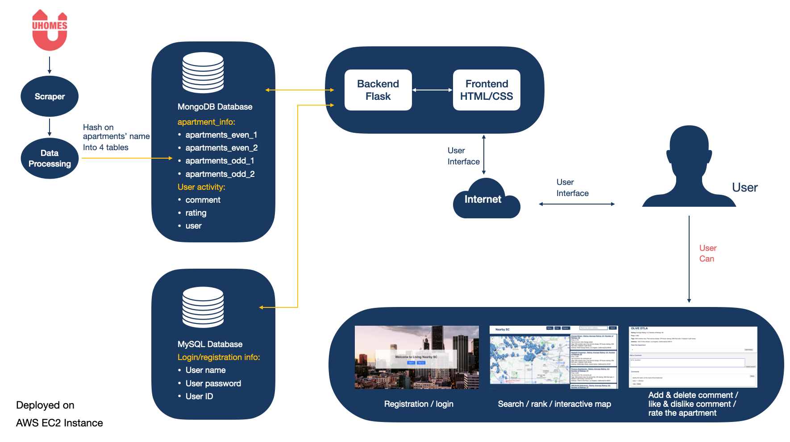

# SP 24 DSCI551 Final Project - Team #40

This repository contains all the necessary code and database setup required for the DSCI551 final project hosted on an EC2 instance.

## Project Overview

All code and databases are designed to run on an Amazon EC2 instance with MongoDB installed. Code can be transferred to the EC2 instance using the `scp` command.

For a detailed walkthrough on setting up and running the project, please refer to this video tutorial:
[Project Setup Video](https://youtu.be/L4tLTKVzk_A)

## Setup Instructions

### Step 1: Data Preparation & Database Input

1. Navigate to the `apartment_data` folder.
2. Run the following Python scripts in order to process and hash the raw data into MongoDB on your EC2 instance:
   - `toJSON.py` - Converts raw data to JSON format.
   - `add_geocode.py` - Adds geocode information to the data.
   - `toMongoDB.py` - Uploads the processed data to MongoDB.

### Step 2: Launching the Backend

1. Change directory to the `query` folder:
   ```bash
   cd query
   python3 backEndMG.py


